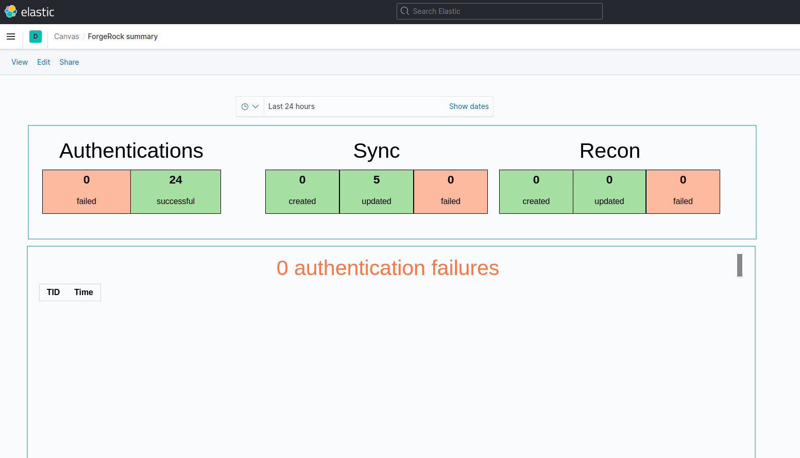
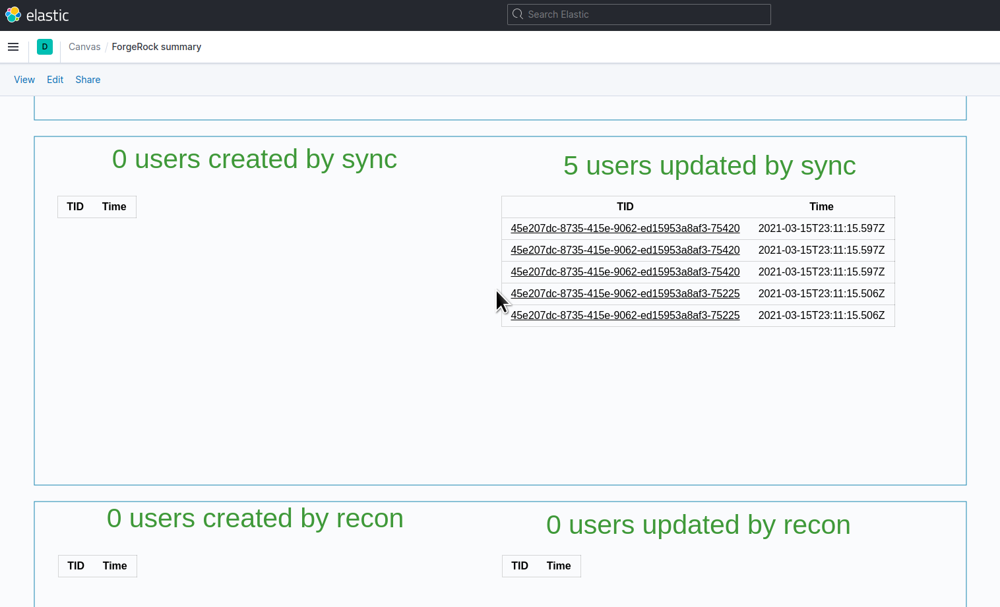

### Changes:

15-Mar-2021 - Disabled logstash and automatic creation of index pattern and Canvas in Kibana
02-Mar-2021 - Using filebeat to pull logs from ForgeRock ID Cloud
22-Feb-2021 - Moved from OSS versions to "Basic" licensed ones. Also filtered out IDM "ping" entries.
18-Dec-2020 - Sync'ed the tail script with upstream (https://github.com/vscheuber/fidc-debug-tools), fixing the issue where the `pagedResultsCookie` was getting reset in case of an error response from the log API.


# An ELK docker stack for ForgeRock Identity Cloud (FIDC)
This docker image contains the complete ELK stack. This is a fork of https://github.com/spujadas/elk-docker.

## To Use

1. First, export environment variables to point to a ID Cloud tenant. Best practice is to create separate `env` files specific to each environment. A template `.env.customername` file is attached:

- [.env.customername](env.customername)

LOG_SOURCE can be a comma separated list of any of the following:
```
am-access
am-activity
am-authentication
am-config
am-core
am-everything
ctsstore
ctsstore-access
ctsstore-config-audit
ctsstore-upgrade
idm-access
idm-activity
idm-authentication
idm-config
idm-core
idm-everything
idm-sync
userstore
userstore-access
userstore-config-audit
userstore-ldif-importer
userstore-upgrade
```
Beware that for every item in the comma separated list, filebeat will make a separate request (using a separate httpjson input). With a large list, one can easily overwhelm the GCP API quotas.

2. Source the environment file

```
$ source .dev.env
```

3. To run the ELK container, use the following file as docker-compose.yml on your machine.

- [docker-compose.yml](docker-compose.yml)

4. Then, to start the containers, from the directory where the above downloaded `docker-compose.yml` is, run the following to start the stack.
```
$ docker-compose up -d
```

5. Wait for a a minute or two for the stack to start up. Optionally, you can tail the container logs to check when the services have started successfully.

6. After that, go to http://localhost:5601/

7. Click the sandwich menu icon and select "Discover".

8. You can now browse / query records.

9. There is also a starter [Canvas](https://www.elastic.co/webinars/intro-to-canvas-a-new-way-to-tell-visual-stories-in-kibana) which show some popular / common statistics.

This can be accessed [HERE](http://localhost:5601/app/canvas#/workpad/workpad-forgerock-summary)

A time period for restricting the data in Canvas can be selected at the top of page.



The reason for using a Canvas vs a Dashboard is because the data (`transactionId`) in the Canvas is clickable.



Clicking on a `transactionId` in one of the tables in the Canvas will take you to the Discover app filtered for that `transactionId`.


## Log event fields
In the logs events, JSON formatted logs are available in `json_payload` map/object and the plain text logs are in `text_payload` object. This information can be used to further query data and create saved queries and visualizations etc in Kibana.

## TODO
